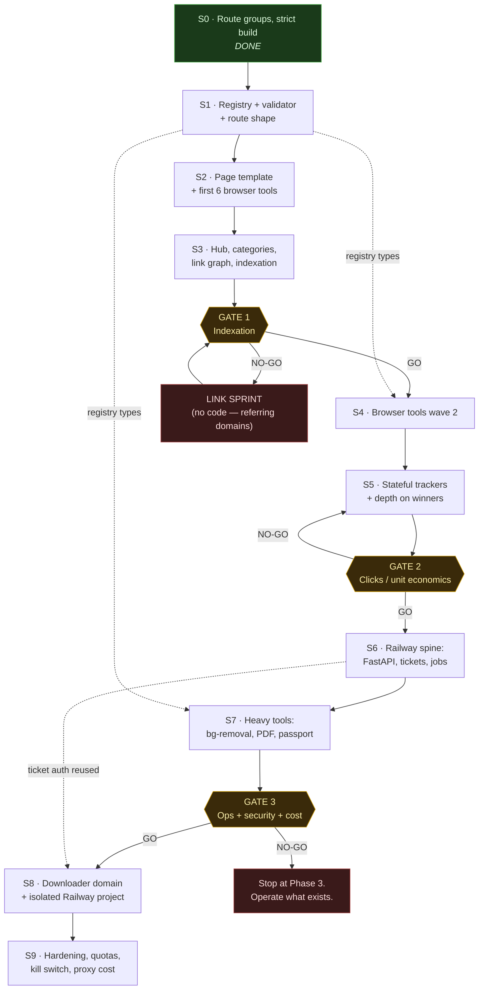

# Tools Platform — Sprint Plan

**For:** Kavitha Kanchana · **Repo:** `kavithakanchana.me` · **Branch:** `tools-platform-phase0`

---

## How to read this document

It was written by 11 agents: one PM/program lead, eight sprint authors working in parallel, one
tech-lead reviewer who read all of them, and one re-run. That parallelism is why the sprints are
deep — and also why **Part II exists and overrides Part III**.

### Reading order — this matters

| Part | What it is | Authority |
|---|---|---|
| **I — Program framework** | Phases, cadence, gates, CI, risk register, Linear setup, maintenance calendar | Authoritative on process |
| **II — Amendments** | The tech-lead review: contradictions between sprints, gaps nobody owned, duplicated work, honest re-estimates | **Highest. Overrides Part III wherever they disagree.** |
| **III — The sprints** | Eight sprint sections with full tickets and code | Authoritative on implementation detail, *as amended by Part II* |

Read **Part II before writing any code.** The sprint authors could not see each other's work, so
they made incompatible assumptions. Part II resolves each one with a ruling. If you build straight
from Part III you will build three different `ToolDef` shapes and find out in month four.

---

## Assembly notes — things I am telling you directly

**1. Sprint numbering differs between Part I and Part III.** The program lead planned nine sprints
(S1 registry → S2 template+tools → S3 hub/links → S4 tools wave 2 → S5 trackers → S6 Railway →
S7 heavy → S8/S9 downloaders). The sprint authors were commissioned against a different eight-sprint
split (S1 platform → S2 PDF/photo → S3 scanner → S4 Railway+OCR → S5 calculators → S6 business →
S7 media → S8 downloaders). **Part III's numbering is the one the tickets use — follow it.** Read
Part I's phase/gate logic, not its sprint numbers.

**2. Sprint 4 was re-run.** The first attempt's output was truncated mid-generation and only its demo
script survived. It was re-authored in two halves (platform, then the OCR tool) and is complete here.

**3. The 30-tool cap is breached by the plan itself.** S1≈2 + S2×2 + S3×2 + S4×1 + S5×10 + S6×10 +
S7×5 = **32 tools**, and `validateTools` throws at >30. The build will literally fail. Part II's ruling
is to cut to ~24 committed (S5→6, S6→6, S7→3), leaving headroom for whatever Gate 1 says actually works.
That is the correct call — the cap is doing its job by catching this before you wrote the code.

**4. The estimates are optimistic by ~1.75×.** Claimed ~320h; the reviewer's honest number is ~560h.
At 16.5h/week that is **34 weeks of build, not 18**. Neither number is wrong, exactly — the sprint
authors estimated the code and skipped the copy, and the registry validator makes copy mandatory
(120-word `howItWorks`, 120-word `gotchas`, 3–6 FAQs, or the build fails). Plan 11–13 months to Phase 4,
or cut scope. Do not plan to the claimed number.

**5. One CI landmine to fix on day one.** `lighthouserc.json` asserts against
`/tools/percentage-calculator` — a slug no sprint ships. Lighthouse against a 404 fails the SEO
assertion and blocks *every PR from the first run*. Either ship that exact slug as S1's proving tool
(it is pure arithmetic with zero regulatory exposure, and is a better choice than the EPF/ETF
calculator S1 currently proposes — that one belongs in S5 where the citation machinery lives), or
generate the URL list from the registry.

**6. What is already done.** Sprint 0 is complete and verified on `tools-platform-phase0`: route
groups `(site)`/`(tools)`, `<body>` width classes stripped, `opengraph-image` scoped to `(site)`,
`ignoreBuildErrors`/`ignoreDuringBuilds` removed, `@db` path alias replacing 10 brittle relative
imports, `blur-fade` typing fixed. `pnpm build` passes with 0 type errors and `/` and `/blog` render
at exactly 672px, unchanged.

**7. Nothing here is verified demand.** Every search-volume judgement behind the tool selection is
qualitative. Before committing to Phase 2, spend one evening in Bing Webmaster Tools (free, real
volumes) and Google Ads Keyword Planner.

---


## Sprint files

| # | File | Sprint |
|---|---|---|
| 1 | [`01-platform.md`](01-platform.md) | Sprint 1 — Tool platform foundation |
| 2 | [`02-pdf-photo.md`](02-pdf-photo.md) | Sprint 2 — File spine 1: exact-KB PDF compressor + photo resizer |
| 3 | [`03-scanner-specs.md`](03-scanner-specs.md) | Sprint 3 — File spine 2: document scanner + spec registry |
| 4 | [`04-railway-ocr.md`](04-railway-ocr.md) | Sprint 4 — Railway backend v1 + OCR pipeline |
| 5 | [`05-calculators.md`](05-calculators.md) | Sprint 5 — Student calculators + Sri Lanka regulatory cluster |
| 6 | [`06-business.md`](06-business.md) | Sprint 6 — Business: ROAS, ROI, churn + cohort tracker |
| 7 | [`07-media-ai.md`](07-media-ai.md) | Sprint 7 — Media/AI: background remover + passport photo |
| 8 | [`08-downloaders.md`](08-downloaders.md) | Sprint 8 — Downloader platform (separate domain) |

Each sprint file is self-contained: Definition of Ready, tickets with real code, risks, Definition of Done, and a demo script.


---

# Part I — Program & PM framework

## Program overview

The tools platform ships in five phases. Phase 0 is complete and merged on `tools-platform-phase0`. Everything after it is gated — not by "did I finish the tickets" but by whether Google is actually indexing what already shipped.

| Phase | Name | Sprints | Nominal hours | Ships |
|---|---|---|---|---|
| 0 | Foundation | S0 | ~20h | **DONE.** Route groups, strict build, `@db` alias, layout isolation |
| 1 | Platform + spine | S1, S2, S3 | ~105h | Registry + validator, page template, first 6 browser tools, hub + category pages, indexation push |
| 2 | Depth | S4, S5 | ~70h | 8–10 more browser tools, the two stateful trackers, internal-link graph, content depth on winners |
| 3 | Heavy compute | S6, S7 | ~70h | Railway FastAPI spine, signed-ticket auth, job queue, background removal / PDF compress / passport photo |
| 4 | Downloaders | S8, S9 | ~70h | Separate domain, separate Railway project, separate billing, yt-dlp + proxy, MP3-default |

Nine sprints after Phase 0. At 15–20h/week that is **18 calendar weeks of build time minimum**, and the gates deliberately insert dead time between phases while pages age in the index. Plan for 6–8 calendar months to reach Phase 4, not 4. If that feels slow, the alternative is shipping 30 pages nobody indexes.

### Dependency graph



The dotted edges matter: `S1` produces the `Tool` type and the validator, and **nothing downstream can start until that type is frozen**. Changing the registry shape in S5 means touching every tool page. Spend the extra 3 hours in S1 getting `Tool` right — including the `status`, `verifiedOn`, and `compute: 'browser' | 'vercel' | 'railway'` discriminants you will need in Phase 3 — even though nothing uses them yet.

---

## Roles and the honest solo-dev adaptation

You are the developer, the tech lead, the PM, the QA, and the on-call. The standard advice is "wear all the hats." That advice is wrong, because hats worn simultaneously collapse into one hat: developer. The observable failure mode for a solo dev is not laziness — it is that PM-Kavitha never gets calendar time, so scope decisions get made at 11pm by dev-Kavitha, who is tired and wants to build the interesting thing.

**The fix is that the hats are time-boxed and mutually exclusive, not simultaneous.** When you are wearing the QA hat you are not allowed to fix the bug you find. Write the ticket. Fix it in a build block.

| Ceremony | Verdict | Why |
|---|---|---|
| Sprint planning | **KEEP**, 90 min hard box | The single highest-leverage hour. This is where the 30-tool cap actually gets enforced. |
| Sprint goal (one sentence) | **KEEP** | Costs 5 minutes. It is the thing you re-read when a sprint starts drifting into a rabbit hole. |
| Daily standup | **DELETE**, replace | You cannot report blockers to yourself. Replaced by the Wednesday written checkpoint (below). |
| Backlog grooming | **COLLAPSE** into planning | A separate 60-min grooming session for a 7-ticket sprint is bureaucracy. 30 min appended to planning. |
| Estimation / planning poker | **COLLAPSE** into planning | There is no one to converge with. Estimate alone, in hours, at planning. |
| Sprint review / demo | **COLLAPSE** into "ship to production" | You have no stakeholders. Deploying to `kavithakanchana.me` *is* the review. But do the QA pass on the Vercel preview URL, on a real phone, before merging. |
| Retrospective | **KEEP**, 20 min, 4 questions | The only mechanism that corrects estimation drift and catches burnout early. Non-negotiable. |
| Burndown chart | **DELETE** | Seven tickets do not need a chart. Track "estimated hours remaining vs. build hours remaining in sprint" as two numbers. |
| Story points / velocity | **DELETE** | See Estimation. |
| Separate QA phase | **DELETE**, replace with the DoD checklist + Friday QA hat | A dedicated QA phase for a solo dev is just deferred bug-fixing. |
| Risk register review | **KEEP**, monthly, 15 min | Half the risks in this program (yt-dlp, tax data, licences) are *time-triggered*, not work-triggered. Nothing else surfaces them. |
| On-call rotation / pager | **DELETE** | You have no SLA and no users paying for uptime. Replace with: a kill switch, a Vercel/Railway failure email alert, and a sentence on the tools hub saying these are free tools with no uptime guarantee. Do not build a pager culture for a side project — that is the fastest route to resenting it. |
| Capacity planning ceremony | **DELETE** | Your capacity is 15–20h. It does not need a meeting. |
| RACI / stakeholder matrix | **DELETE** | R, A, C and I are all you. |

---

## Cadence

**Two-week sprints. 15–20 h/week → a sprint is 30–40 nominal hours, and you commit to 21.** (Why 21, see Estimation.)

The rhythm that survives a full-time job, a startup, and a degree:

| Day | Block | Hat | Typical work |
|---|---|---|---|
| **Mon** | 45 min, evening | PM | Sprint planning (week 1) or mid-sprint checkpoint (week 2). Read the GSC scoreboard first — 15 min. |
| **Tue** | 2–2.5 h, evening | Dev | Build block. Tickets ≤ 2h only. |
| **Wed** | — | — | **Off. Deliberately.** A protected zero-guilt day is what makes weeks 6–18 possible. |
| **Thu** | 2–2.5 h, evening | Dev | Build block. Tickets ≤ 2h only. |
| **Fri** | 30 min, evening | QA | Walk the DoD checklist against the current preview URL. On a real phone. Write tickets, fix nothing. |
| **Sat** | 4 h, morning | Dev | **The deep block.** The only slot where WASM, Railway, auth, or anything needing >2h of loaded context is allowed to start. |
| **Sun** | 2–3 h | Content | Registry copy: `howItWorks`, `gotchas`, FAQs, meta. Low-energy-compatible, and it is genuinely half the work. |

≈ 16.5h/week. Two rules that do more than the schedule itself:

1. **Never start a task larger than the block.** A 6-hour WASM integration begun in a 2-hour Tuesday block costs you 8 hours, because you pay the context-reload tax twice.
2. **Content is scheduled, not squeezed.** The `validate.ts` rules (120-word `howItWorks`, 3–6 FAQs, 120–165 char description) mean a tool without copy *does not build*. Sunday is the release valve. Skip Sunday twice and the sprint fails on content, not code.

### Sprint planning — 90 min, timeboxed

- 0–15: read the scoreboard. Indexed pages, earning pages, spend. Not impressions.
- 15–30: retro carry-over — what did last sprint's 4 answers say to change?
- 30–70: pick tickets to a **21-hour commitment**, applying the current drag coefficient. Every ticket must pass Definition of Ready or it goes back to Backlog.
- 70–85: write the one-sentence sprint goal. Add the 4-hour `buffer` reserve ticket.
- 85–90: identify the single riskiest ticket and schedule it for the **first** Saturday block. Risk goes early, always.

### Mid-sprint checkpoint — written, Monday of week 2, 20 min

Replaces 10 standups. Post it as a comment on the Linear cycle:

```
Goal: <sprint goal>
Hours burned: 11 of 21 committed. Hours left in sprint: 16.
Done: TLS-104, TLS-107
In flight: TLS-109 (est 5h, 4h in, ~60% — flagging)
Risk: ffmpeg.wasm bundle is 8MB, will blow the Lighthouse budget
Cut decision: dropping TLS-112 to next sprint. Not negotiating with myself later.
```

The cut decision line is the whole point. A solo dev who does not write down the cut simply works later on Thursday and calls it commitment.

### Retro — 20 min, exactly 4 questions

1. What shipped, and what did I say would ship? (the number, not the story)
2. What did I estimate at X and it took Y? What was the actual cause — unknown API, content writing, or yak shave?
3. What did I do this sprint that a phase gate says I should not have been doing at all?
4. Energy check, 1–5. If it is ≤ 2 for two retros running, **the next sprint is a half-sprint by decree**, not by collapse.

Question 3 is the one that kills side projects. It is very easy to spend a sprint polishing a tool page while Gate 1 is red.

---

## Estimation

**Hours. Not story points.**

Story points exist to solve two problems you do not have: (a) normalizing estimates across developers of different speeds, and (b) letting a team forecast without committing an individual to a clock. With one developer, points are a lossy encoding of hours with an extra conversion step — and worse, "velocity" becomes a self-flattering number that hides the fact that you did 11 real hours in a week you told yourself was 18. Hours are falsifiable against a calendar. Points are not. Estimate in hours, log actuals in hours, and let the ratio be the signal.

### Reference table — calibrated to this codebase

| Work | Hours | Notes |
|---|---|---|
| Registry entry: types + slug + category + related | 0.5 | Mechanical once `Tool` is frozen |
| **Registry content**: metaTitle, 120–165 desc, 120w howItWorks, 120w gotchas, 3–6 FAQs | **2.5** | The most under-estimated item in this entire program. It is writing, and writing is slow. |
| New shadcn component wired into an existing form | 1 | `@radix-ui` is already in deps |
| Pure-browser widget, no WASM (converter, calculator, regex tester, formatter) | 4–6 | Includes edge cases and empty/error states |
| Browser widget with WASM (`ffmpeg.wasm`, `pdf-lib`, image pipelines) | 8–12 | Bundle budget and `next/dynamic ssr:false` wiring are half of it |
| JSON-LD `@graph` block + Rich Results validation | 2 | First time. 0.5 thereafter — it is a shared component |
| Static page using the frozen template | 1.5 | Post-S2 |
| Next.js route handler: zod validation + rate limit + error shape | 3 | |
| Mongoose model + route handlers for a stateful tracker | 5 | Remember: route handlers only, never from a tool page |
| First FastAPI endpoint on Railway (Dockerfile, deploy, env, healthcheck) | 6–8 | One-time platform cost |
| Subsequent FastAPI endpoint | 2–3 | |
| HMAC ticket mint + verify + Redis `jti` + CORS lock | 6 | Security work. Estimate high, review twice. |
| Job queue: POST → `job_id`, polling endpoint, TTL cleanup | 6 | |
| Vitest unit tests for one widget's pure logic | 1.5 | |
| Playwright smoke test for one tool page | 2 | |
| Chasing a Lighthouse budget failure | 3 | Unbounded tail — timebox it and `status: 'beta'` the tool if it overruns |
| Sprint admin (planning + checkpoint + retro) | 2.5 / sprint | Budget it as a ticket. It is real work. |

### Handling the 2x

You will underestimate. Everyone does; solo devs do it worse because there is no one to say "that's not three hours." Three mechanisms, all cheap:

**1. Commit to 60% of nominal.** A sprint has 30–40 nominal hours. Commit **21 hours of estimates**. The remaining hours absorb reality: a build that breaks, a work deadline, a bad week. If you finish early, pull from the top of the backlog. Committing to 35 of 35 guarantees a failed sprint, and failed sprints are how motivation dies.

**2. Rolling drag coefficient.** After each sprint compute `D = Σactual / Σestimate` over the trailing 3 sprints. **Initialize D = 1.6.** At planning, multiply every raw estimate by the current D before committing. If your raw estimates total 13h and D is 1.6, you have committed 21h. D is the only "velocity" number worth keeping, and unlike points it tells you something true: how wrong you currently are.

**3. The 2x tripwire, decided in the moment.** When a ticket passes 2× its estimate, you stop and make an explicit decision *right then*, and write it in the ticket:
- **Split** — ship the working 70%, new ticket for the rest;
- **Cut** — this tool goes `status: 'beta'`, ships noindexed, comes back later;
- **Continue** — allowed, but you must name what you are dropping from the sprint to pay for it.

What is not allowed is silently continuing. That is how one tool eats a sprint and the phase gate slips a month.

---

## Definition of Ready

A ticket may not enter a sprint unless every box is checked. Enforced at planning; a ticket that fails goes back to Backlog, it does not get "planned anyway."

- [ ] Has a Linear ID and a title starting with the sprint ticket ID (`S3-04 — …`)
- [ ] Phase label, area label, and type label applied
- [ ] Estimate in hours, ≤ 8h (anything larger must be split — an 8h ticket does not fit in any single block)
- [ ] Dependencies listed and either Done or scheduled earlier in the same sprint
- [ ] Files-touched list written (even approximate — it is how you catch "this actually touches the registry type")
- [ ] Acceptance criteria written as a checklist, phrased so a stranger could verify them
- [ ] If it adds a tool: target keyword named, and the tool is confirmed to fit under the 30-tool cap
- [ ] If it touches compute: `compute` tier declared, and estimated cost per 1000 runs written in the ticket
- [ ] If it touches a model: licence named and confirmed against the allowed list (no CodeFormer, no LaMa)
- [ ] If it touches auth, upload handling, ticket signing, or middleware: labelled `risk:security`, which triggers the cooling period in the release rules

## Definition of Done

Nothing merges to `main` without all of these. This is the checklist you walk on Friday with the QA hat on.

- [ ] CI green: typecheck, lint, unit tests, `validate:registry`, `build`, Lighthouse budget
- [ ] Zero new TypeScript errors — `ignoreBuildErrors` is gone, so this is enforced, not aspirational
- [ ] Verified on the **Vercel preview URL**, not localhost
- [ ] Verified on a real phone at 375px, and at 1280px
- [ ] Both light and dark themes checked (`next-themes` is in the stack)
- [ ] If it is a tool page: template order intact (breadcrumb → H1 → meta row → intro → **widget above the fold** → how it works → gotchas → FAQ → related → author card → JSON-LD)
- [ ] Widget renders above the fold at 375px without scrolling past it
- [ ] JSON-LD validates in Google's Rich Results Test, and `@id`-references `#person` and `#website`
- [ ] Word count 400–700
- [ ] **No `@db` import in any tool page** (grep it — this is the connection-pool rule, and it will be violated by accident)
- [ ] Page appears in `sitemap.xml` if `status: 'stable'`; absent and `noindex` if `status: 'beta'`
- [ ] Errors and empty states handled — not just the happy path
- [ ] Ticket's acceptance checklist ticked, actual hours logged
- [ ] For `risk:security` tickets: re-read the diff ≥ 12 hours later, with the security checklist open

---

## Branching, environments, and release

### Branching

Trunk-based, short-lived branches, squash merge.

```
main                          protected; every merge deploys to production
<type>/<TICKET>-<slug>        feat/TLS-104-registry-validator
                              fix/TLS-131-og-cache-headers
                              chore/TLS-140-renovate-config
                              content/TLS-118-pdf-merge-copy
                              spike/TLS-122-birefnet-eval   (never merged; deleted after)
```

Branch lifetime target: **≤ 4 days.** A branch older than one sprint is a merge conflict with `src/data/resume.tsx` waiting to happen.

### Is PR-to-self theatre?

Partly yes, and you should be honest about which part.

**The "approve" click is theatre. Delete it.** Do not configure required reviewers. Do not sit on a PR for 24 hours pretending an independent reviewer will arrive. Squash-merge as soon as CI is green.

**The PR itself is not theatre. Keep it, always.** Three reasons that have nothing to do with review:
1. It is the trigger for CI and for the **Vercel preview URL** — and the preview URL is where your DoD verification happens. No PR, no preview, no honest QA.
2. It is the durable link from ticket → diff → deploy. In eight months, "why is this `revalidate` 3600?" is answerable in fifteen seconds instead of not at all.
3. Reading your own diff in GitHub's split view, cold, catches a different class of mistake than reading it in the editor while writing it. It is a cheap altitude change. It genuinely works.

**One real exception where self-review must become slow:** anything labelled `risk:security` — the HMAC ticket minting, `jti` replay tracking, CORS config, upload handling, `middleware.ts`. Those get a mandatory **12-hour cooling period** and a second read the next morning against a written checklist. Not because a rule says so, but because those are the only changes in this program that you cannot un-ship. A leaked signing key or an unbounded upload path is not a rollback situation.

### Environments

| Environment | Where | Trigger | Data |
|---|---|---|---|
| Local | `pnpm dev` | — | Local `.env.local`, dev Mongo |
| Preview | Vercel | Every PR | Dev Mongo, Railway `staging`, Turnstile test keys |
| Production | Vercel | Merge to `main` | Prod Mongo, Railway `production` |
| Railway `staging` | Railway project `tools-api` | Push to `main` of the API repo | Own Redis, low quotas |
| Railway `production` | Railway project `tools-api` | Manual promote | Own Redis, real quotas |
| Downloaders | **Separate Railway project `dl-api`, separate domain** | Manual promote | Own everything, own billing alert |

No separate staging site on Vercel. Preview deploys already give you a per-PR URL; a long-lived staging environment for a solo dev is one more thing to keep in sync and one more place for env drift.

**The `dl-api` isolation is a program-level decision, not an implementation detail.** Separate project means separate billing, separate abuse surface, separate suspension blast radius. If Railway suspends the downloader project, the calculators keep working and `kavithakanchana.me` — which is your professional identity — is untouched.

### Migration and rollback

The registry-not-database decision means **most of this platform has no migrations at all.** Tool config is code; rolling back a tool is `git revert`. That is the payoff for decision #4 and you should feel good about it every time a rollback takes ninety seconds.

Where Mongo is genuinely used (churn cohort tracker, ROI scenarios), use expand/contract, strictly:

1. **Expand** — deploy code that writes the new field and reads both old and new. Additive only.
2. **Backfill** — run the script out-of-band, idempotent, batched, logged.
3. **Contract** — one sprint later, deploy code that reads only the new field.
4. Only then drop the old field.

Never rename a field. Never deploy a read that depends on a write shipped in the same deploy. Rollback paths:

- **Vercel:** instant rollback to the previous deployment in the dashboard. Test that you know where the button is *before* you need it.
- **Railway:** redeploy the previous image. Keep the last 3.
- **Mongo:** there is no rollback. This is why expand/contract is mandatory and why tool pages are forbidden from touching the database at all.
- **Sitemap/index:** if you ship a bad tool page, `status: 'deprecated'` + 410 is safer than deleting the route and serving a soft-404.

### Feature flags for half-finished tools

No flag service. The registry `status` field *is* the flag, and it is compile-time:

```ts
export type ToolStatus = "draft" | "beta" | "stable" | "deprecated";
```

| Status | In `generateStaticParams` | Robots | Sitemap | Hub grid | Reachable |
|---|---|---|---|---|---|
| `draft` | **No** — not built at all | n/a | No | No | Local only |
| `beta` | Yes | `{ index: false, follow: true }` | No | No | Direct URL + `/tools/beta` |
| `stable` | Yes | indexable | Yes | Yes | Everywhere |
| `deprecated` | Yes | `{ index: false, follow: true }` | No | No | Direct URL, with a banner |

Two rules that matter more than the table:

- **`dynamicParams = false` means `draft` tools 404 in production.** That is correct and intentional — a half-finished tool must not be crawlable at any URL.
- **Never index → noindex → index the same URL.** Choose `beta` *before* the first deploy of a tool, and promote to `stable` exactly once. Flip-flopping a URL's indexability teaches Google that the URL is unstable, and you will spend weeks earning back a page you could have simply held for one sprint.

---

## Quality gates

Four scripts to add to `package.json` first (S1-01), plus `tsx` and `vitest` as devDependencies:

```json
"scripts": {
  "dev": "next dev",
  "build": "next build",
  "start": "next start",
  "lint": "next lint",
  "typecheck": "tsc --noEmit",
  "test": "vitest run",
  "validate:registry": "tsx scripts/validate-registry.ts"
}
```

`validate.ts` already runs at module scope inside `registry.ts`, so `pnpm build` catches bad registry data. The standalone script exists so it fails in ~8 seconds instead of ~90, which is the difference between a check you respect and a check you start skipping.

### `.github/workflows/ci.yml`

```yaml
name: CI

on:
  pull_request:
    branches: [main]
  push:
    branches: [main]

concurrency:
  group: ci-${{ github.ref }}
  cancel-in-progress: true

env:
  NEXT_TELEMETRY_DISABLED: "1"

jobs:
  # Fast feedback. Fails in seconds on the most common mistakes.
  static:
    name: Typecheck · Lint · Registry
    runs-on: ubuntu-latest
    timeout-minutes: 10
    steps:
      - uses: actions/checkout@v4

      - uses: pnpm/action-setup@v4
        with:
          version: 9

      - uses: actions/setup-node@v4
        with:
          node-version: 22
          cache: pnpm

      - name: Install
        run: pnpm install --frozen-lockfile

      # Registry first: it is the cheapest check and the one most likely
      # to fail, because it validates hand-written content, not code.
      - name: Validate tool registry
        run: pnpm validate:registry

      - name: Typecheck
        run: pnpm typecheck

      - name: Lint
        run: pnpm lint

      - name: Unit tests
        run: pnpm test

      # Enforce the connection-pool rule mechanically. minPoolSize is 5,
      # so a single @db import in a statically generated tool page can pin
      # Atlas connections from every warm lambda. Reviewers forget. grep does not.
      - name: No database imports in tool pages
        run: |
          if grep -rnE "from ['\"]@db(/|['\"])" src/app/\(tools\)/ ; then
            echo "::error::Tool pages must never import from @db. Use a route handler."
            exit 1
          fi

  build:
    name: Build · Lighthouse budget
    runs-on: ubuntu-latest
    needs: static
    timeout-minutes: 20
    steps:
      - uses: actions/checkout@v4

      - uses: pnpm/action-setup@v4
        with:
          version: 9

      - uses: actions/setup-node@v4
        with:
          node-version: 22
          cache: pnpm

      - name: Install
        run: pnpm install --frozen-lockfile

      # No MONGODB_URI in CI on purpose: sitemap.ts must survive without it.
      # Its try/catch static fallback is load-bearing and this proves it.
      - name: Build
        run: pnpm build

      - name: Lighthouse CI
        uses: treosh/lighthouse-ci-action@v12
        with:
          configPath: ./lighthouserc.json
          uploadArtifacts: true
          temporaryPublicStorage: true
```

### `lighthouserc.json`

```json
{
  "ci": {
    "collect": {
      "startServerCommand": "pnpm start",
      "startServerReadyPattern": "Ready in",
      "url": [
        "http://localhost:3000/",
        "http://localhost:3000/tools",
        "http://localhost:3000/tools/percentage-calculator"
      ],
      "numberOfRuns": 3,
      "settings": { "preset": "desktop" }
    },
    "assert": {
      "assertions": {
        "categories:performance": ["error", { "minScore": 0.95 }],
        "categories:accessibility": ["error", { "minScore": 0.95 }],
        "categories:seo": ["error", { "minScore": 1 }],
        "categories:best-practices": ["warn", { "minScore": 0.95 }],

        "largest-contentful-paint": ["error", { "maxNumericValue": 2000 }],
        "cumulative-layout-shift": ["error", { "maxNumericValue": 0.05 }],
        "total-blocking-time": ["error", { "maxNumericValue": 200 }],

        "resource-summary:script:size": ["error", { "maxNumericValue": 260000 }],
        "resource-summary:total:size": ["error", { "maxNumericValue": 900000 }],

        "unused-javascript": "off",
        "uses-long-cache-ttl": "off"
      }
    },
    "upload": { "target": "temporary-public-storage" }
  }
}
```

Two deliberate choices. **CLS ≤ 0.05, not the default 0.1**, because the widget sits above the fold and a widget that shifts on hydration is the single most damaging thing you can do to a tool page's Core Web Vitals. **The script budget is asserted on the page shell**, which is exactly why WASM widgets must be `next/dynamic(..., { ssr: false })` — an 8MB `ffmpeg.wasm` chunk that is never in the initial bundle does not blow a 260KB budget. If a tool cannot meet this, it ships `beta` and noindexed until it can.

---

## The phase gates

This is the most important section in the document. Everything above it is about shipping efficiently. This section is about **not shipping**, which for this program is the harder and more valuable skill.

The baseline is stark and you should keep it in front of you: **~9 clicks and ~268 impressions per 28 days.** That is a site Google barely knows exists. Adding thirty pages to a site Google barely knows exists produces thirty pages Google barely knows exist. The bottleneck is indexation and authority, not inventory — and every gate below is designed to stop you from solving the wrong problem enthusiastically.

### Gate 1 — Indexation (after S3, plus 6 weeks of aging)

**Do not run this gate early.** New URLs need 3–6 weeks to be discovered, crawled, and indexed. Measure only URLs published ≥ 21 days ago.

**Where to look:**
- GSC → **Indexing → Pages** → filter by sitemap `sitemap.xml`. Read the "Why pages aren't indexed" table. The line that matters is *"Crawled – currently not indexed"* — that is Google saying "I saw it and judged it not worth storing."
- GSC → **Performance → Search results** → Pages tab → filter *Page contains `/tools/`*, date range last 28 days.
- GSC → **URL Inspection** on your three best tools individually.

**Criteria — all three must pass:**

| Metric | Threshold |
|---|---|
| Indexation rate on tool URLs aged ≥ 21 days | **≥ 70%** |
| Tool URLs with ≥ 25 impressions in 28 days | **≥ 1** |
| Median days from publish to first impression | **≤ 21** |

**Decision rules:**

- **All three pass → GO to Phase 2.** Ship more tools. The machine works.
- **Indexation 40–69% → CONDITIONAL. Ship zero new tools for one sprint.** Spend that entire sprint on indexation mechanics: contextual internal links from `/` and every `/blog/*` post into tool pages, a dedicated `/sitemap-tools.xml` segment so you can measure that cohort separately, an IndexNow ping for Bing, fixing any soft-404 or duplicate-title findings, and adding genuine depth to the 3 weakest pages. Then re-run the gate.
- **Indexation < 40%, or zero tool impressions after 6 weeks → NO-GO. Stop building tools entirely and run the Link Sprint.**

**The Link Sprint** (30–40h, no product code — this is the branch people refuse to take, and it is usually the correct one):

- One genuine launch post of your single best tool on a community that will actually read it, written as a build story rather than a promotion.
- Submissions to 5 tool aggregators/directories that have real editorial review.
- 3 Sri Lanka–relevant directories or aggregators — you have a geographic angle most of your competitors do not.
- 2 guest posts or podcast/newsletter appearances in your actual professional lane.
- One genuinely linkable asset: a small original data study you can produce from something you already have access to. Data gets linked; calculators get used and forgotten.
- Success criterion: **≥ 5 net-new referring root domains within 8 weeks.** If you cannot move that number, more tools will not help, and you should say so out loud rather than building tool #14.

### Gate 2 — Clicks and unit economics (after S5)

Phase 3 is where you start paying per invocation. Do not buy compute for traffic you do not have.

**Where to look:** GSC Performance (28d, `/tools/` filter) for clicks and position; Vercel Analytics or your own event counter for widget completion.

| Metric | Threshold |
|---|---|
| Total site clicks / 28 days | **≥ 200** (from a baseline of 9) |
| Of which, clicks to `/tools/*` | **≥ 120** |
| "Earning pages" — unique URLs with ≥ 1 click in 28 days | **≥ 8** |
| Tool pages at average position ≤ 10 for their exact target query | **≥ 1** |
| Widget completion rate (started → produced output) | **≥ 40%** |

- **All pass → GO to Phase 3.** Build the Railway spine.
- **Clicks pass but completion < 40% → the tools are not good, they are just findable.** Spend a sprint on the widgets themselves before adding harder ones. A 40% completion rate means 6 in 10 visitors bounced off your UI — adding background removal will not fix that, it will just make it expensive.
- **Any click threshold fails → NO-GO. Go deeper, not wider.** Take your top 3 earning pages and triple their depth: more FAQs, real worked examples, a supporting blog post, an embeddable version. One page at position 8 that you push to position 3 is worth more than five new pages at position 40. Re-run the gate in 8 weeks.

### Gate 3 — Operations, security, and cost (after S7)

Phase 4 is the highest-risk surface in the program: legally exposed, proxy-dependent, expensive at ~$180/1000 for 1080p, and the most likely to get a project suspended. Earn it.

| Metric | Threshold |
|---|---|
| Consecutive days of Railway tools live | **≥ 30** |
| p95 job latency | **< 20s** |
| Job error rate | **< 2%** |
| Railway spend, trailing 30 days | **< $25** |
| Modeled spend at 10× current volume | **< $150/month** |
| Kill switch deliberately tripped in production and verified | **Yes** |
| Security incidents involving the upload pipeline | **0** |
| Total site clicks / 28 days | **≥ 400** |

- **All pass → GO to Phase 4**, on the separate domain and separate Railway project, with MP3 as the default and 1080p behind Turnstile + a hard daily quota.
- **Any fail → NO-GO, and this one is a real stop, not a delay.** Operating Phase 3 well is a perfectly good end state. The downloaders are the part of this plan most likely to cost you money, a domain, or a weekend of incident response. They are optional. Treat them as optional.

**The untested kill switch clause is deliberate.** A kill switch you have never tripped is a kill switch you do not have. Trip it in production once, on purpose, on a low-traffic evening, and confirm you get a 503 and no invocations.

---

## Metrics and the scoreboard

### Impressions is the wrong primary metric

Impressions is the metric this program will be tempted to optimize, and it is the one that will lie to you most convincingly. Three reasons:

1. **It rises with irrelevant matches.** A page ranking at position 74 for a query you never targeted accrues impressions. You cannot spend impressions.
2. **It rewards volume, which is exactly the failure mode the 30-tool cap exists to prevent.** Every new page adds impressions almost regardless of quality. Optimizing impressions is optimizing for content farming, and the cap is there because content farming is a manual-action risk.
3. **It moves without you.** Google reshuffles a SERP feature and your impressions double. Nothing changed. You will credit the sprint.

**The primary metric is "earning pages": the count of unique URLs with ≥ 1 click in the trailing 28 days.**

It is the right metric because it is the conjunction of all three things that must be true — the page is indexed, it ranks somewhere a human sees it, and a human chose it. It cannot be inflated by publishing volume, because a page that earns nothing does not count. And it maps directly to the gates: Gate 1 is "can we get indexed at all," Gate 2 is "do indexed pages earn," Gate 3 is "does earning justify spend."

Supporting metrics, in priority order: **indexation rate** (leading indicator, moves 3–4 weeks before clicks), **median days-to-first-impression** (crawl-budget health — if this climbs past 30 days, your site is being deprioritized), **clicks per earning page** (are you going deeper or just wider), **widget completion rate** (is the product good), and **cost per 1000 runs** (from Phase 3).

### The tracking sheet

One row per week, filled in Monday in 15 minutes. Columns:

`week_ending` · `sprint` · `phase` · `tools_stable` · `tools_beta` · `urls_submitted` · `urls_indexed` · `indexation_pct` · **`earning_pages`** · `clicks_28d` · `clicks_tools_28d` · `impressions_28d` *(logged, never optimized)* · `avg_position_best_tool` · `top_query` · `median_days_to_first_impression` · `referring_root_domains` · `widget_completion_pct` · `vercel_usd_mtd` · `railway_usd_mtd` · `cost_per_1000_runs` · `hours_worked` · `tickets_done` / `tickets_committed` · `drag_coefficient_D` · `energy_1_5` · `notes`

`hours_worked`, `energy_1_5` and `D` sit in the same sheet as the SEO numbers on purpose. The most likely cause of this program failing is not a technical one; it is week 14, when the numbers are still small and you are tired. Having both trends visible in one place is what lets you notice that *before* it becomes a three-month gap in commit history.

---

## Risk register

Reviewed monthly, 15 minutes. Owner is always Kavitha — the column records which *hat*, because that is what determines when it gets attention.

| # | Risk | Category | Likelihood | Impact | Owner (hat) | Mitigation | Trigger signal |
|---|---|---|---|---|---|---|---|
| R1 | **Indexation failure** — tools ship but never get indexed | SEO | **High** | **High** | PM | Gate 1 blocks Phase 2 entirely; Link Sprint branch pre-specified so the pivot needs no new decision under pressure; internal links from `/` and `/blog/*`; segmented tools sitemap | "Crawled – currently not indexed" > 30% of tool URLs aged ≥ 21 days |
| R2 | **Cost blowout** on Railway | Cost | Medium | **High** | Tech lead | Per-IP-hash daily quotas and a global spend kill-switch returning 503 are **v1, not v2** (decision #11); Railway hard usage limit set below the pain threshold; billing alert at 50% and 80%; downloaders in an isolated project with its own cap | Daily spend > 3× trailing 7-day median, or any single day > $5 |
| R3 | **yt-dlp breakage** — YouTube changes extraction | Technical | **Very high** (assume quarterly) | Medium | Dev | Pin the version; weekly automated dependency check; a canary job every 6h against one known-good video; user-facing "temporarily unavailable" state that is honest rather than a stack trace; MP3 default reduces surface area | Canary fails twice consecutively |
| R4 | **Stale tax/rate data causing real harm** | Legal / trust | Medium | **Very high** | PM | Every finance tool carries `effectiveFrom`, `sourceUrl`, `verifiedOn` in the registry; **build fails if a `stable` finance tool's `verifiedOn` is > 180 days old**; visible "rates as of {date}, verify with IRD" line on the page; no personalized advice, ever | Sri Lanka budget speech; any IRD circular; the 180-day build failure |
| R5 | **Security incident from file upload** | Security | Medium | **Very high** | Tech lead | Signed single-use ~2min HMAC tickets with Redis `jti` tracking; CORS locked to origin; Turnstile before expensive ops; hard size and MIME allowlists; process files in an ephemeral container, never persist; `risk:security` label forces the 12h cooling period and a second read | Any unexplained Railway egress spike; any 4xx/5xx pattern from a single IP hash; any unrecognized `jti` |
| R6 | **Burnout / velocity collapse** | People | **High** | **Very high** | PM | Wednesdays off, non-negotiable; commit to 60% of nominal; retro question 4 tracks energy; two consecutive scores ≤ 2 forces an automatic half-sprint; gates create legitimate dead time and you are allowed to enjoy it | `hours_worked` < 10 for two weeks running, OR energy ≤ 2 twice, OR a week with zero commits |
| R7 | **Google manual action** ("thin/doorway pages") | SEO | Low | **Very high** | PM | The 30-tool cap in `validate.ts`; 400–700 words of genuinely original `howItWorks` and `gotchas` per page enforced at build; every tool must actually work in-browser; no scaled programmatic city/currency permutations; tools live on the personal domain and reinforce the `#person` entity | Any GSC Manual Actions message; a >40% traffic drop inside 72h |
| R8 | **Railway account suspension** (downloaders) | Vendor | Medium | **High** (contained) | Tech lead | Isolated `dl-api` project on a separate domain with separate billing — the entire point of decision #1; personal site and calculators keep working; no shared credentials between projects | Any Railway ToS or abuse notice |
| R9 | **Model licence violation** | Legal | Low | **Very high** | Tech lead | Allowed list is canon: u2net, BiRefNet, Real-ESRGAN, Tesseract, PaddleOCR, faster-whisper, MediaPipe. **Never CodeFormer, never LaMa.** GFPGAN treated as unsafe. DoR requires naming the licence; licence recorded in the registry entry; quarterly re-verification | Any model version bump; any new model added; the quarterly review |
| R10 | **Scope creep past the 30-tool cap** | Program | **High** | Medium | PM | `TOOLS.length > 30` throws at module scope and fails the build; raising `MAX_TOOLS` requires a PR titled `policy:` and a green phase gate; backlog may hold 100 ideas, the repo may hold 30 | A build failure on the cap, or any PR touching `MAX_TOOLS` |
| R11 | AGPL network clause (PyMuPDF, Ghostscript) misunderstood | Legal | Low | Medium | Tech lead | Hosted use is fine; document the reasoning once in `docs/licences.md`; never distribute a client binary containing them | Any decision to ship a desktop/CLI build |
| R12 | Mongo connection exhaustion from tool pages | Technical | Medium | High | Tech lead | `minPoolSize: 5` makes this real; **CI greps for `@db` imports under `src/app/(tools)/`**; trackers use route handlers only | Atlas connection-count alert; any CI grep failure |

---

## Backlog hygiene and tooling

### The cap is the process

Most scope control is a discipline problem. Here it is a compiler problem, and that is worth more than any amount of willpower:

```ts
// src/lib/tools/validate.ts
export const MAX_TOOLS = 30;

if (tools.length > MAX_TOOLS) {
  throw new Error(
    `Tool registry has ${tools.length} entries, cap is ${MAX_TOOLS}. ` +
      `This cap is a deliberate anti-content-farm policy. Raising it is a ` +
      `policy decision, not a build fix — see docs/scope.md.`,
  );
}
```

Ideas are free and live in Linear's Backlog. Slots are scarce and live in the registry. **Tool #31 does not exist until tool #7 is deleted, or until a PR titled `policy: raise tool cap to N` is merged with a green phase gate cited in the description.** That single throw does more scope management than a roadmap document.

Pair it with the freshness check that protects R4:

```ts
const STALE_AFTER_DAYS = 180;

for (const tool of tools) {
  if (tool.status !== "stable" || tool.category !== "finance") continue;
  const age = (Date.now() - new Date(tool.verifiedOn).getTime()) / 86_400_000;
  if (age > STALE_AFTER_DAYS) {
    throw new Error(
      `Tool "${tool.slug}" was last verified ${Math.round(age)} days ago ` +
        `(${tool.verifiedOn}). Re-verify rates against ${tool.sourceUrl}, ` +
        `then bump verifiedOn. Stale tax data is the highest-harm bug in this repo.`,
    );
  }
}
```

This is the mechanism that makes the maintenance calendar real rather than aspirational: skip the tax review and **the site stops deploying.**

### Ticket ID conventions

Two IDs, deliberately, and they do not conflict:

- **Plan ID** — `S3-04`. Sprint 3, ticket 4. Stable, human-readable, and it is what the sprint documents and this framework refer to. It never changes even if Linear is rebuilt.
- **Linear ID** — `TLS-104`. Auto-numbered by Linear, used in branch names, commit trailers, and PR titles.

Every Linear issue title begins with the plan ID, so the mapping is lossless in both directions:

```
TLS-104 · "S3-04 — Build /tools/category/[category] with generateStaticParams"
branch:  feat/TLS-104-tools-category-route
commit:  feat(tools): static category pages (S3-04, TLS-104)
```

Prefix conventions for non-sprint work: `BUG-`, `OPS-` (maintenance calendar items), `SEC-` (security), `SEO-`, `SPIKE-`. Spikes are always timeboxed in the title: `SPIKE-07 — BiRefNet vs u2net quality (4h box)`.

### Linear setup

**One team.** Not one per phase. `Tools Platform`, key `TLS`.

**Cycles:** 2 weeks, auto-created, aligned to sprint boundaries starting on a Monday. Enable "auto-add unfinished issues to next cycle" — it makes carry-over visible instead of letting it evaporate.

**Workflow states** — six, and deliberately no `QA` state:

| State | Type | Means |
|---|---|---|
| `Backlog` | backlog | Idea. May be nonsense. No DoR required. |
| `Ready` | unstarted | Passes Definition of Ready. Eligible for a cycle. |
| `In Progress` | started | Branch exists. **Max 2 issues here at once — enforce it manually, it is the WIP limit that matters.** |
| `In Review` | started | PR open, CI green, preview URL verified against DoD |
| `Done` | completed | Merged to `main` and live |
| `Canceled` | canceled | Explicitly killed. Write why — cancellation reasons are the best input to retro question 3. |

**Estimates:** set the team's estimate scale to **Exponential (1, 2, 4, 8, 16)** and read it literally as hours. Anything estimated 16 fails Definition of Ready and must be split. This gives you Linear's built-in cycle charts while keeping the honest unit.

**Labels:**
- `phase:0` … `phase:4`
- `area:registry` · `area:widget` · `area:content` · `area:seo` · `area:railway` · `area:infra` · `area:security`
- `type:feat` · `type:fix` · `type:chore` · `type:content` · `type:spike`
- `risk:security` — triggers the 12h cooling period
- `buffer` — the 4h reserve ticket, one per cycle
- `blocked` — with the blocker named in a comment, always

**Projects = phases.** `Phase 1 — Platform + spine`, etc. **Milestones = phase gates**, with the numeric criteria pasted into the milestone description so you cannot quietly renegotiate them later. That last detail is worth more than it looks: gates get softened in the moment, and the defense is having written the number down when you were calm.

**Importing this plan:** the sprint documents use `## S1-04 — Title` headings with a fixed sub-structure (estimate, dependencies, files touched, acceptance criteria). That is machine-splittable — either paste each ticket into Linear's markdown issue creator, or generate a CSV with columns `Title, Description, Estimate, Labels, Project, Cycle, Status` and use Linear's CSV import. Import as `Backlog`, then promote to `Ready` only after each ticket passes DoR at planning. Do not import straight to `Ready`; that skips the one gate that keeps underspecified tickets out of sprints.

---

## Maintenance calendar

Once tools are live, the program stops being purely a build and becomes partly an operation. These obligations are real work and must be budgeted — reserve **2 hours per sprint** from Phase 2 onward, and open them as `OPS-` tickets so they compete honestly for time instead of being invisible.

| Item | Cadence | What it involves | Out-of-cycle trigger |
|---|---|---|---|
| **Sri Lanka tax / PAYE / VAT rates** | Every 6 months, **enforced by the build** | Re-verify each finance tool against the IRD source, update rates, bump `verifiedOn`, note changes in the page's "Updated" line | Budget speech (typically Nov); any IRD circular; the 180-day build failure |
| **yt-dlp** | Weekly automated check + **6-hourly canary** | GitHub Action opens a PR on new release; canary downloads one known-good video and alerts on failure | Canary fails twice consecutively; any YouTube extraction error spike |
| **Model licences** | Quarterly | Re-read the licence for every shipped model; confirm nothing drifted onto the banned list | Any model version bump; any new model proposed in a ticket |
| **Spec registries** (passport photo dimensions, device specs, currency lists) | Quarterly | Re-verify against the issuing authority, bump `verifiedOn` | A user report; any government spec change |
| **Dependency patch sweep** | Monthly | Renovate grouped PR, merge if CI is green | — |
| **Next.js minor upgrades** | Within 30 days of release | You are on 14.2.35; stay current inside 14.x | — |
| **Security advisories** | **Within 72 hours** | `pnpm audit`, Dependabot alerts, patch or document why not | Any critical/high advisory touching mongoose, next, or the Railway image |
| **Cost review** | Weekly glance (scoreboard) + monthly deep review | Reconcile Railway and Vercel against the rate card; recompute cost per 1000 runs; verify quotas and the kill switch are still configured | Daily spend > 3× trailing 7-day median |
| **GSC review** | Weekly, Monday, 15 min | Fill the scoreboard row. Indexation, earning pages, days-to-index | Any Manual Actions message; >40% traffic drop in 72h |
| **Kill-switch drill** | Quarterly | Actually trip it in production. Confirm 503, confirm zero invocations, confirm you can restore it | Before every Gate 3 evaluation |
| **Risk register review** | Monthly, 15 min | Re-score likelihood and impact; check every trigger signal fired or didn't | Any risk materializing |
| **Registry audit** | Every phase gate | Every `beta` tool: promote, fix, or delete. Every `deprecated` tool: confirm it should still exist. Count against the 30 cap | — |
| **Backup verification** (tracker collections) | Quarterly | Restore a snapshot into a scratch database and confirm it opens | Before any expand/contract migration |

The `beta` audit at each gate is the one that quietly matters. `status: 'beta'` is an excellent pressure valve — and it is also where half-finished work goes to live forever. Auditing it at every gate means a tool can be parked for at most one phase. After that it ships properly, or it is deleted and its slot returned to the cap.


---

# Part II — Amendments and rulings

> **This overrides the sprint files wherever they disagree.** Read it before writing code.

## Cross-sprint review

Nine authors, one type system. The good news: nobody violated the connection-pool rule or the static-generation rule outright. The bad news: `ToolDef` has three different shapes across the sprints that consume it, the 30-tool cap is arithmetically breached before Sprint 7 starts, and the Railway spine that Sprints 7 and 8 both depend on is not written by anybody.

---

### Contradictions found

| Where | What sprint A says | What sprint B says | The ruling |
|---|---|---|---|
| **`ToolDef.Widget`** | S1 `PLAT-01` puts `Widget: ToolWidget` (a `ComponentType`) directly on the interface, and `PLAT-02` validates `typeof t.Widget`. | S2 DoR and S6 DoR both say widgets resolve through a slug→`next/dynamic` map (`src/lib/tools/widgets.ts`). | **Remove `Widget` from `ToolDef`.** A component reference on the registry type means importing `TOOLS` imports every widget — into the hub, into `/tools/category/*`, into `sitemap.ts`, into `validate.test.ts`. That is exactly the bundling failure `PLAT-01`'s own comment warns about. Registry stays serializable data; `src/lib/tools/widgets.ts` owns the `Record<string, ComponentType>` of `dynamic()` calls. Delete the `Widget` rule from `validateTools`; replace with a build assert that every slug has a map entry. |
| **Status enum** | S1 `PLAT-01`: `type ToolStatus = "live" \| "beta"`. | PM framework: `"draft" \| "beta" \| "stable" \| "deprecated"`, with a four-row table driving `generateStaticParams`, robots, sitemap and the 410 rollback path. | **PM framework wins.** `PLAT-01` as written makes `draft` (never built), `deprecated` (410 + banner) and the DoD line "in sitemap if `status: 'stable'`" unimplementable. Fix in `PLAT-01`, before anything imports it. |
| **Compute discriminant** | S1 `PLAT-01`: `runsOn: "browser" \| "railway" \| "hybrid"`. | PM framework: `compute: 'browser' \| 'vercel' \| 'railway'`; DoR checklist requires "`compute` tier declared". | **Name it `compute`, keep four members: `browser \| vercel \| railway \| hybrid`.** `runsOn` has no `vercel` member, so S6 `BUSI-07` (cohort tracker, Mongo via route handler) is unrepresentable — it is neither browser nor Railway. |
| **H1 field name** | S1 `PLAT-01`: `title` ("The H1"). | S5 `CALC-01` reads `tool.h1` in three places (`generateMetadata`, `ArchivedRatePage`, the banner). | `title`. `CALC-01`'s page file does not compile against `PLAT-01`. |
| **Updated-date field** | S1 `PLAT-01`: `updatedAt`. | S5 `CALC-01` sitemap snippet: `new Date(t.updatedOn)`. | `updatedAt`. Same class of error — S5 was written against an imagined type. |
| **Validator entry point** | S1 `PLAT-02` exports `validateTools(tools)`. | S2 DoR: "calls `validateRegistry(TOOLS)` at module scope". S5/S6 DoR: "`validate.ts` runs at module scope". | `validateTools`. Fix S2's DoR text; it is a Definition-of-Ready gate that will read as unmet. |
| **`next.config.mjs` `headers()`** | S3 `SCAN-01` adds `source: "/vendor/:path*"` immutable, and S3's own DoR warns "must not clobber an existing one". | S7 `MEDI-01` writes a **complete** `nextConfig` whose `headers()` returns only `/:dir(models\|ort)/:path*`, with the comment "these are the only assets in /public that are allowed an immutable cache". | `MEDI-01` clobbers `SCAN-01` and silently un-caches 9 MB of OpenCV and 3.2 MB of MediaPipe. **Merge, don't replace**: one `headers()` returning `/vendor/*`, `/models/*`, `/ort/*`. And `MEDI-01`'s config also drops whatever else lives in the real `next.config.mjs` today — it must be written as a diff, not a file. |
| **Vendored-asset policy** | S2 DoR: MediaPipe wasm + tflite **committed** to git (~3.2 MB). S3 DoR: OpenCV **committed** (~9 MB), "Do not `postinstall`-download it." | S7 `MEDI-02`: model and ORT artifacts **gitignored**, fetched in `prebuild` with a sha256 gate. | Pick one and write it as an ADR. My ruling: **fetch-with-digest for anything ≥ 4 MB** (OpenCV, ONNX), **commit anything < 1 MB**. But then `MEDI-02`'s specific source must change — it points at a `rembg` release tagged `v0.0.0` with a placeholder digest (`8e83ca70…0000`). A build that depends on a third party not deleting a release tag is a build you will lose on a Tuesday. Mirror the weights into an R2 bucket you control and pin that. |
| **Shareable-state convention** | S5 `CALC-02`: query string, hydration-safe mount effect, `history.replaceState`, explicitly no `useSearchParams`. | S6 `BUSI-03`: `location.hash`, "so nobody's revenue projections land in Vercel's request logs" — while S6's *own* DoR puts board state in a query param (`?b=SLUG`). S3 `SPEC-04`: `?preset=spec:<id>`. | **One primitive, `useToolUrlState`, owned by S5 `CALC-02`.** Query string for anything non-sensitive and worth linking (presets, public inputs); hash for user-entered financial figures. S6 imports it and passes a `sensitive: true` flag. Three hand-rolled codecs across three sprints is three places to get the base64url padding wrong. |
| **Who owns `<ToolShell>`** | S1 sprint goal: "Ship … `<ToolShell>`". S2 DoR: expects `ToolShell` chrome from S1. | S6 DoR: "Sprint 2 (shared widget shell `<ToolShell>`, copy/reset/export helpers, `track()`)". | S1 owns `<ToolShell>`. S6's DoR is pointing at the wrong sprint, which matters because `track()` (see Gaps) is a Gate 2 dependency. |
| **Sprint 7's dependency** | S7 DoR: "**Sprint 5/6**: the Railway FastAPI service skeleton, the HMAC ticket minting route, the job API, the quota + kill-switch." | S5: "nothing in this sprint calls Python." S6: no Railway, no Python. | S7 depends on **Sprint 4** (the OCR/Railway sprint, which exists only as a QA fragment). Fix the pointer, then go write Sprint 4. |
| **Citation shape** | S1 `PLAT-01`: `ToolSource { label, url, verifiedOn }`. | S5 `CALC-01`: `Citation { title, publisher, reference, url, publishedOn, archivePath }`. S2 DoR: presets carry "`source` URL and `verifiedOn`". S7 DoR: photo-specs carry `sourceUrl` + `verifiedOn`. | Four shapes for one concept. **`Citation` (S5) wins** — it is the only one with a publisher and an archive path, and link rot is a certainty over an 8-month program. `ToolSource` becomes `type ToolSource = Citation`. |
| **Staleness mechanism** | `PLAT-01`: `reviewEveryDays` on the tool. | `PLAT-01`: `verifiedOn` on each source. `CALC-01`: `verifiedOn` + `nextReviewOn` on each `RateTable`, driving a cron in `CALC-11`. | Three overlapping clocks. **Keep `RateTable.nextReviewOn` as the only machine-readable one**; drop `reviewEveryDays` from `ToolDef` (nothing consumes it — `PLAT-01`'s own comment admits the review script is "deferred to Sprint 2" and Sprint 2 does not build it). |
| **Sprint commitment size** | PM framework: "commit **21 hours** of estimates", D = 1.6, plus a 4h buffer ticket and a 2.5h admin ticket. | S1 36h · S3 38h · S5 39h · S7 39h · S8 38h — every sprint commits at the top of the nominal band, none carries buffer or admin tickets. | The framework is right and all nine sprints ignore it. Real committed load per sprint is ~45h against a 21h target — **2.1×**. Every sprint below needs re-planning, not re-estimating. |
| **Ticket ID scheme** | DoR: titles start with `S3-04 —`. Checkpoint example uses Linear IDs `TLS-104`. | Sprints use `PLAT-01`, `CORE--01` (double hyphen), `SCAN-01`, `CALC-01`, `BUSI-01`, `MEDI-01`, `DOWN-01`. | Cosmetic, but pick one before Linear has 90 issues in it. Recommend `S5-CALC-01`. Fix the `CORE--01` typo now. |

---

### Gaps between sprints

Work nothing owns. Each assigned, with an ID and an estimate.

| Gap | Why it bites | Owner | Estimate |
|---|---|---|---|
| **The entire Railway spine sprint.** S7 and S8 both reference "the compute foundation" — FastAPI skeleton, HMAC ticket mint/verify, `jti` replay tracking, job queue, quotas, kill switch. The only trace is an unlabelled QA fragment about OCR PDF. | Canonical decisions #9, #10, #11 are unimplemented by any written ticket. S7 cannot start. | **New Sprint 4, full ticket list.** From the reference table: FastAPI first endpoint 6–8h + HMAC/Redis/CORS 6h + job queue 6h + Turnstile 3h + quota/kill-switch 4h + one tool 6h + content 2.5h. | **~35h, i.e. its own sprint** |
| **`track()` / widget-completion instrumentation.** Gate 2 requires "widget completion rate (started → produced output) ≥ 40%". No sprint builds an event counter. S6 DoR assumes it exists from S2; S2 does not build it. | **Gate 2 is unmeasurable, so it will be waived**, and waiving a gate is how you buy Railway compute for traffic you don't have. | S1, new ticket `PLAT-16` — a zero-dependency beacon to a Vercel route handler, two events (`tool_start`, `tool_complete`), IP-hash only. | 3h |
| **CLS-safe widget mounting.** Every tool page mounts an `ssr: false` widget above the fold against a **0.05** CLS budget. Nobody owns the reserved-height skeleton. | The single most likely cause of a red Lighthouse gate, on every tool page simultaneously. | S1, `PLAT-17` — `<WidgetFrame minHeight>` that reserves exact space, required by `ToolShell`. | 2h |
| **The ESLint `no-restricted-imports` `@db` rule.** S2's DoR says to *extend* it to `src/lib/tools/**` — but no S1 ticket creates it. And the CI grep only scans `src/app/(tools)/`, which does not contain the widgets. A `@db` import in `src/components/tools/business/RoasWidget.tsx` passes CI and gets bundled into a statically generated page. | Decision #4 is enforced against the wrong directory. | S1, `PLAT-18` — ESLint rule + widen the CI grep to `src/app/(tools)/ src/lib/tools/ src/components/tools/`. | 1.5h |
| **Mongo pool config for the tracker route handlers.** Decision #4's stated reason is `minPoolSize: 5`. S6 `BUSI-07` writes to Mongo from route handlers — which pins 5 connections per warm lambda, the exact failure the rule exists to prevent, just from a different file. | The rule was written as a file-location ban, not a connection budget. | S6, `BUSI-11` — separate connection helper for tool route handlers with `minPoolSize: 0, maxPoolSize: 2`. | 2h |
| **`/sitemap-tools.xml` segment.** The framework holds this as a *remedy* for a failed Gate 1. | You cannot measure a cohort you didn't segment before publishing. Building it after Gate 1 fails means starting the 21-day clock over. | S1, `PLAT-19`. | 1.5h |
| **Internal link graph from `/` and `/blog/*` into tools.** PM framework's S3 is "hub, categories, **link graph**, indexation". The written S3 is an OpenCV scanner. | Decision #12 says indexation is the bottleneck. Orphan pages don't get crawled. | S2, `LINK-01` — contextual links from the homepage and every existing blog post. | 3h |
| **Gate-check tickets.** No sprint contains "run Gate 1 / Gate 2 / Gate 3". | An unticketed gate is an optional gate. | One ticket per gate on the sprint boundary. | 1.5h each |
| **`src/lib/tools/licences.ts`.** Referenced in a comment in S7 `MEDI-02`. Never created. The DoR requires "licence named and confirmed against the allowed list". | CodeFormer and LaMa are non-commercial and will be tempting when u2netp's edges disappoint. | S7, fold into `MEDI-02`. | +0.5h |
| **Privacy policy + "no uptime guarantee" line on the hub.** Framework mandates the sentence; S6 introduces `TOOLS_IP_SALT`; S8 hashes IPs for quotas. | A salted IP hash is still personal data. Free tools with no policy page and a DMCA surface is an avoidable problem. | S1, `PLAT-20`. | 2h |
| **Cloudflare zone in front of the *tools* Railway API.** The S4 QA fragment assumes Cloudflare Security Events and Turnstile for `tools-api`. S8 mints a **new** Cloudflare account for the downloader only. Nobody says where the tools-api zone comes from. | Decision #9's Turnstile-and-CORS story has no host. | Sprint 4 DoR. | 1h |
| **Max word counts in `validate.ts`.** The validator enforces floors (120w `howItWorks`, 120w `gotchas`) but no ceilings, while the DoD demands 400–700 total. | The floor is enforced by the build; the ceiling is enforced by nobody, so pages drift to 1,100 words of filler. | S1, extend `PLAT-02`. | +0.5h |
| **Duplicate `metaTitle` / `description` detection across the registry.** | S5 and S6 ship 20 near-identical calculators. Duplicated meta descriptions are the canonical cause of "Crawled – currently not indexed" — the *exact* metric Gate 1 measures. This is the highest-leverage missing validator rule in the program. | S1, extend `PLAT-02`: exact-duplicate `metaTitle`/`description` throws; >0.8 trigram similarity warns. | +1.5h |
| **Turnstile on the S7 paid tier.** Decision #9 requires it in front of expensive ops. `MEDI-01/02/03` never mention it. | An unauthenticated background-removal endpoint is a free GPU for someone else. | S7, inherit from Sprint 4's ticket-mint route; add an acceptance criterion. | +1h |

---

### Duplicated work

| Thing built twice (or thrice) | Owner | What the others do |
|---|---|---|
| **Web Worker harness.** S2 `CORE--02` (`src/lib/tools/worker/{protocol,client,file-worker,use-file-job}`), S3 `SCAN-02` (`src/workers/scanner.worker.ts`, `src/lib/scanner/client.ts`), S7 `MEDI-03` (`segmentation.worker.ts`, `segmentation-client.ts`). Three message protocols, three progress shapes, three cancel mechanisms, three error taxonomies. | **S2 `CORE--02`.** Its `WorkerRequest`/`WorkerResponse` union and `FileJobClient` are the generic ones. | S3 and S7 add a job *kind* to the discriminated union and register a handler. Saves ~5h in S3, ~4h in S7, and one debugging session where cancel works in one tool and not another. |
| **Cache-Storage-backed large asset loader.** S3 `SCAN-01` `cachedBlob` + `evictOldVersions`; S7 `MEDI-02` `loadModelBuffer` + `pruneOldCaches`. Same streaming-progress loop, same version-eviction, same "cache may be unavailable" fallback. | **S3 `SCAN-01`**, promoted to `src/lib/tools/assets/cached-fetch.ts`. | S7 `MEDI-02` imports it. −2h from S7. |
| **Binary-search-to-exact-byte-ceiling.** S2 `CORE--01` `compressToTarget` / `compressWithEscalation`. S7's passport photo maker must hit per-country KB ceilings and does not declare S2 as a dependency. | **S2 `CORE--01`.** | S7 adds S2 to its DoR and injects `encodeAt`. |
| **Exam photo resizer (S2) vs passport photo maker (S7).** Both do: face detection → crop to a spec's exact pixel dimensions → compress to a KB ceiling → stamp DPI. S2 even vendors `@mediapipe/tasks-vision` + `blaze_face_short_range.tflite` for it. S7 rebuilds the same product with ONNX segmentation. | This is the largest duplication in the program. **Ruling: they are one tool with two spec sets.** S2 ships the engine and the exam presets; S7 adds the passport/visa presets and the *optional* background-replacement step (which is the only genuinely new capability). | Rewrite S7's passport ticket as "add photo specs + background replacement to the S2 photo tool", not a new tool. **Frees ~8h and one registry slot.** |
| **Spec/preset registry.** S2 DoR hardcodes exam presets with `source` + `verifiedOn`. S3 `SPEC-01`–`SPEC-04` builds "the dated upload-spec registry". S7 depends on `src/lib/tools/photo-specs.ts`. S5 `CALC-01` builds `RateTable` — a *third* dated-fact registry with the same effective-dating, citation and review semantics. | **One generic `DatedFact<T>` pattern, owned by S5 `CALC-01`** (`assertRateFamily` is the most rigorous of the three — it checks gaps, overlaps, exactly-one-open-ended). | S3's spec registry and S7's photo-specs become `DatedFact<UploadSpec>` and `DatedFact<PhotoSpec>`. But this means **`CALC-01` must move to Sprint 2** (see Sequencing). |
| **EPF/ETF calculator.** S1 `PLAT-04` hardcodes statutory rates (its DoR requires hand-verifying them). S5 owns the Sri Lanka regulatory cluster and builds the citation-backed rate-table pattern EPF/ETF should sit on. | **S5.** | S1's "prove the template end to end" tool should be pure arithmetic with zero regulatory exposure. Shipping a hardcoded statutory calculator in week 2 that S5 rewrites in month 4 is a rewrite plus a `dateModified` churn on an indexed URL. |
| **Number parsing / currency formatting.** S6 `BUSI-01` (`parseNumber`, `formatCurrency`, `en-US`) and S5 `CALC-02`'s `codec.ts` + `format.ts` (`en-GB` in `SourceNote`). | **S5 `CALC-02`.** It ships first and has the field-spec type system. | S6 `BUSI-01` becomes an import, not a file. Also: fix the locale split — `en-GB` in one formatter and `en-US` in another on the same site is visible to users. −2h from S6. |

---

### Canonical-decision violations

| Decision | Violation | Fix |
|---|---|---|
| **#4 — registry, not database; no tool page imports `@db`** | Not violated in letter, but the *enforcement* is. The CI grep covers `src/app/(tools)/` only; the widgets live in `src/components/tools/**` and `src/lib/tools/**` and are imported into those pages. And S6 `BUSI-07` writes to Mongo from route handlers with the shared `connectToDatabase` (`minPoolSize: 5`), reproducing the exact connection-pinning the rule exists to prevent. | Widen the grep + ESLint rule (`PLAT-18`); dedicated pool for tool route handlers (`BUSI-11`). |
| **#5 — build-time validator** | `PLAT-02` implements the letter of it. But `PLAT-01` putting `Widget` on `ToolDef` means `validate.ts` — and every consumer of `TOOLS` — pulls React components into scope, including `sitemap.ts`. That is a violation of the *spirit* of "registry is typed data". | Remove `Widget` from `ToolDef`. |
| **#6 — route shape is `/tools`, `/tools/[slug]`, `/tools/category/[category]`** | S5 `CALC-01` adds a fourth route, `/tools/[slug]/[year]`, without amending the decision. Next resolves `/tools/category/pdf` to the static segment ahead of `[slug]/[year]`, so it works — but it is now structurally ambiguous and one config change from a collision. | Amend decision #6 explicitly to four routes, and add a validator rule: no `archiveSlug` may equal a `ToolCategory`, and no tool slug may equal `"category"` (`RESERVED_SLUGS` already covers the second). |
| **#7 — locked template order** | S5 `CALC-01` renders `<SourceNote>` "directly under the widget" with its own `<h2>` ("Where these numbers come from"), inserting an unplanned H2 between the widget and "How it works". S5 also inserts a `banner` above the H1 on archive pages. | Either amend the template order once, deliberately (my preference: `SourceNote` after Gotchas, as `<h3>`), or move it. Do not let nine sprints each add one block "directly under the widget". |
| **#7 — widget above the fold, `ssr: false`** | Complied with everywhere, and combined with the 0.05 CLS budget that compliance is a bug with no owner. See `PLAT-17`. | — |
| **#11 — cost caps are v1** | S7 ships a paid Railway tier for background removal with no quota, no kill-switch check and no Turnstile in any of `MEDI-01/02/03`. It assumes Sprint 4 built them but never wires them. | Add acceptance criteria to S7's paid-tier ticket: request is rejected without a valid ticket; kill-switch returns 503 with the calm panel; per-IP-hash quota enforced. |
| **#12 — indexation is the bottleneck** | The most-violated decision, structurally. S3 spends 38h on a 9 MB OpenCV scanner and S4 spends a sprint on Railway OCR — both of which should be sitting inside Gate 1's mandatory 6-week aging window, and both of which ship tool pages that must themselves then age. No sprint ships an internal-link graph. | See Sequencing. |
| **30-tool cap (decision #5)** | **Arithmetic breach.** S1 ≈2, S2 2, S3 2, S4 ≈1, S5 **10**, S6 **10**, S7 **5** = **32 > 30**, and `validateTools` throws. Worse: S7's own DoR requires `TOOLS.length <= 25` before it starts, and S5+S6 alone put you at ~26. **Sprint 7 cannot begin without a policy edit to `MAX_TOOLS`.** | This is the plan's hardest structural constraint and it was breached by three authors independently, each of whom wrote a DoR line telling themselves to check. Cut to ~24 committed: S5 → 6 calculators, S6 → 6, S7 → 3 (helped by folding the passport tool into S2's). Keeps 6 slots of headroom for whatever Gate 1 says is actually working. |

---

### Estimate sanity check

Against the framework's own reference table — registry content **2.5h per tool**, pure-browser widget **4–6h**, WASM widget **8–12h** — and D = 1.6 applied as the framework instructs. Sprint admin (2.5h) and buffer (4h) are added because every sprint omitted them.

| Sprint | Claimed | Honest | Multiple | Why |
|---|---|---|---|---|
| **S1** Platform | 36h | **52h** | 1.4× | `PLAT-01` 2h + `PLAT-02` 3h is fair, but the sprint also claims registry, `ToolShell`, hub, category pages, JSON-LD (2h first time), sitemap, OG caching (`PLAT-12`), GSC (`PLAT-15`) **and one full tool** (4–6h widget + 2.5h content). Add the six missing platform tickets from Gaps (`PLAT-16`–`PLAT-20`, ~10h). |
| **S2** File spine 1 | 30–40h | **65h** | **~1.9×** | Two WASM tools in one sprint. Reference table: 8–12h *each*, before the shared engine. `CORE--01` 4h + `CORE--02` 4h are the only estimates given; the pdfjs raster pipeline, `pdf-lib` structural pass, MediaPipe face detection, two widgets, two × 2.5h content, vitest and Playwright are unestimated. Also fighting the 260 KB script budget with `pdfjs-dist` + `pdf-lib` + MediaPipe in the tree. |
| **S3** File spine 2 | 38h | **60h** | 1.6× | `SCAN-02` at **6h** for the full OpenCV detect-and-warp pipeline with Mat lifetime discipline, tested on a Snapdragon 6-series, is the most optimistic single number in the program. Budget 12h. Plus a second tool, the spec registry, the validator tool, and 2 × 2.5h content. |
| **S5** Calculators | 39h | **82h** | **~2.1× — worst offender** | `CALC-01` 4.5 + `CALC-02` 5.5 = 10h platform, leaving 29h for **ten calculators** — 2.9h each, when content alone is 2.5h and a pure-browser widget is 4–6h. Floor: 10 × (2.5 content + 3.5 logic/tests/registry) = **60h**, plus 10h platform, plus the DoR itself (reading IRD/EPF/ETF/Gratuity/VAT/SSCL acts and four university handbooks and archiving them to `docs/sources/`) which is a full day nobody costed. **Split into two sprints of five.** |
| **S6** Business | 30–40h | **74h** | **~2.0×** | Same ten-calculator arithmetic (~60h), plus `BUSI-07`: a stateful Mongo tracker with TTL indexes, IP-salt hashing, board sharing and expand/contract discipline — the reference table says 5h for a Mongoose model + route handlers, and this is considerably more than that. **Split.** |
| **S7** Media/AI | 39h | **68h** | 1.7× | `MEDI-03` at **6h** for ORT pre/post-processing, mask upsample, feathering and compositing — with the explicit warning that "nearly right" is worse than broken — is 12h of work. Plus the refinement UI, the paid Railway tier, and 5 × 2.5h = 12.5h of content that is not in the 39h. Folding the passport tool into S2's photo tool recovers ~8h. |
| **S8** Downloaders | 38h | **~90h** | **~2.4×** | This is not a sprint, it is a platform: new registrar, new Cloudflare account, new Railway account with its own payment method, new Redis, new Vercel project, **two new repos**, R2 with lifecycle rules, seven platform extractors, the resolve fork, a job queue, proxy tiers, a PO-token provider service, an abuse mailbox and a DMCA process — plus an entire frontend (`dl-web`) for which there is not a single ticket. `DOWN-01` at 3h does not include creating the accounts. **Split into S8a (isolation + direct-handoff-only, ~40h) and S8b (worker path, proxies, YouTube, ~45h).** |

Program total: claimed ~9 sprints × ~36h ≈ 320h. Honest ≈ **560h**. At 16.5h/week that is **34 weeks of build time**, not 18 — and the framework already says to plan 6–8 months. Plan 11–13, or cut two of the twenty calculators-worth of scope.

---

### Sequencing corrections

1. **Write Sprint 4.** It is referenced by S7 ("Sprint 5/6") and S8 ("the compute foundation sprint") and exists only as a QA fragment. Until its tickets exist, decisions #9, #10 and #11 are aspirational. Fix S7's dependency pointer to Sprint 4 while you are there.
2. **Move `CALC-01` (dated fact tables + `assertRateFamily`) from S5 to S2.** S2 hardcodes exam presets with `source`/`verifiedOn` in its DoR; S3 builds a spec registry; S7 needs photo specs. All three are the same pattern and all three land before S5. Building it fourth means three migrations.
3. **Move the `next.config.mjs` `headers()` immutable-cache rule from S3 `SCAN-01` to S2.** S2 vendors 3.2 MB of MediaPipe first; without the header those ship as `max-age=0, must-revalidate` for a whole sprint. Then S7 `MEDI-01` extends it rather than replacing it.
4. **Move the `FontLoader` deletion from S7 `MEDI-01` to S1.** It is a free LCP win on *every page including the homepage and blog* — precisely what a site with 268 impressions/28 days needs — and it is currently sitting four months out inside a media sprint. Ten minutes of work, wrong sprint.
5. **Move `track()` (`PLAT-16`) to S1.** Gate 2 sits after S5 and requires 28 days of completion-rate data. Instrumentation added in S5 makes Gate 2 unmeasurable until S6.
6. **Move `/sitemap-tools.xml` (`PLAT-19`) and the internal-link graph (`LINK-01`) to S1/S2.** Both are currently Gate-1 *remedies*. A cohort you didn't segment can't be measured, and a remedy applied after failure restarts the 21-day clock.
7. **Reorder S3 and S4 against Gate 1.** Per the framework, Gate 1 runs after the hub ships plus 6 weeks of aging. The written S3 (OpenCV scanner) and S4 (Railway OCR) are both product work that should be *inside* that window — but S4 spends real money on Railway before Gate 2 has cleared, which decision #12 and Gate 2 both forbid ("do not buy compute for traffic you do not have"). **Ruling: S4 moves after Gate 2.** The dead time after Gate 1 is for the Link Sprint, not for standing up FastAPI.
8. **Split S5 and S6 into halves; split S8 into two.** See estimates. Twelve sprints, not nine.
9. **Fix `lighthouserc.json` before the first CI run.** It asserts against `http://localhost:3000/tools/percentage-calculator`, a slug no sprint ships. Lighthouse against a 404 fails the SEO assertion (`minScore: 1`) and blocks every PR from day one. Either ship that exact slug in S1 as the proving tool — it is pure arithmetic, zero regulatory exposure, and would neatly replace the EPF/ETF calculator in `PLAT-04` — or make the URL list generated from the registry.

---

### The five things most likely to go wrong

**1. Content debt fails the build, and the sprint dies on writing, not code.**
`validate.ts` throws on a 119-word `gotchas`. S5 and S6 together need **20 × 2.5h = 50h of prose**, all of it landing on the Sunday block, which is also the block that gets sacrificed when work is busy. The framework says it out loud — "skip Sunday twice and the sprint fails on content, not code" — and then S5 and S6 each schedule ten tools anyway.
*Early warning:* a branch sitting for more than three days with `pnpm build` red on a `description` length error. That is not a formatting problem; that is the schedule telling you.

**2. `Widget` on `ToolDef` bundles every widget into every page, and the Lighthouse budget takes the whole tool section down with it.**
`PLAT-01` puts a `ComponentType` on the registry type. `sitemap.ts`, the hub, `/tools/category/*` and `validate.ts` all import `TOOLS`. By S5 that is twenty widgets — including `pdf-lib`, `pdfjs-dist` and MediaPipe — resolvable from the initial graph of every route. The 260 KB script assertion is an `error`, so CI goes red on every tool page at once; the escape hatch in the framework is "ships `beta` and noindexed", which means **Gate 1 auto-fails because nothing is indexable**. One type field, three failures deep.
*Early warning:* First Load JS in the `next build` route table growing on `/blog/[slug]` — a route with no tools on it at all — after the first registry entry with a real widget lands. Compare against the baseline S1's DoR tells you to record.

**3. The 30-tool cap hard-stops the program mid-Sprint 7.**
S5 (10) + S6 (10) + everything before = ~26. S7's DoR demands ≤ 25 to start. `validateTools` throws, `pnpm build` fails, and the decision gets made at 11pm by dev-Kavitha, who will raise `MAX_TOOLS` to 40 because the alternative is not shipping tonight. That is the exact failure mode decision #5 was written to prevent, and the cap is a one-line edit.
*Early warning:* `TOOLS.length > 22` at the end of S6. Put the number in the Monday scoreboard read, next to indexed pages.

**4. Gate 1 goes red and gets quietly reinterpreted.**
Gate 1's NO-GO branch is a 30–40h Link Sprint with **no product code**: guest posts, directory submissions, an original data study. The framework calls it "the branch people refuse to take". Meanwhile S3 (OpenCV scanner) and S4 (Railway OCR) are already written, already interesting, and already sitting in the backlog looking like progress. Retro question 3 exists solely to catch this and it is the question that gets answered charitably.
*Early warning:* indexation on the first six tool URLs below 40% at week 6 — but the *real* signal comes earlier: a sprint plan that includes a Railway ticket while the Gate 1 scoreboard has never been read aloud. If the Monday 15-minute scoreboard block gets skipped twice, this has already happened.

**5. The downloader platform costs 20× its model, or takes the domain with it.**
Two specific mechanisms, both already in the code as written. `probe_direct` in `DOWN-02` calls `httpx.AsyncClient().get(url, headers={"Range": "bytes=0-1"}, follow_redirects=True)` — httpx **buffers the full response body**, so any CDN that ignores `Range` streams the entire 45 MB MP4 through Railway on what is supposed to be a metadata-only probe. That is the ~$0.10/1000 path silently becoming the ~$2–11/1000 path. Second, `DOWN-01`'s Dockerfile upgrades yt-dlp at container start with `>/dev/null 2>&1`, so a failed upgrade is invisible and every autoscale event adds a PyPI round trip to boot latency.
*Early warning:* Railway egress on `dl-api` that does not track the `mode: "worker"` job count — the ratio is the tell. And the moment the `direct` fraction in `/v1/resolve` drops below ~70%, the whole cost model in the sprint header is void; that number belongs on the daily dashboard from the first deploy, not in a retro.

---

### Two code-level defects worth fixing before the tickets are estimated

- **S2 `CORE--01`, `compressWithEscalation`:** each ladder rung re-runs the full two-probe preamble, so a 6-rung ladder costs up to `6 × 8 = 48` encodes. On a 40 MB PDF at ~3s per raster encode that is a two-and-a-half-minute worst case with no wall-clock bound anywhere in the ticket. Add a total-time budget to `EscalationOptions` and carry the failed floor probe forward between rungs.
- **S8 `DOWN-01`, `settings.py`:** `class Config: populate_by_name = True` is pydantic v1 style inside a pydantic-settings v2 `BaseSettings`, and env resolution through `Field(alias=...)` rather than `validation_alias` is version-sensitive. Use `model_config = SettingsConfigDict(populate_by_name=True)`. A settings class that silently reads the wrong env var is how `GLOBAL_KILL_SWITCH` ends up defaulting to `False` on the day you need it.
- **S6 `BUSI-07` (implied):** `TOOLS_BOARD_TTL_DAYS` cannot be changed after first deploy by editing the env var — Mongoose does not re-issue `expireAfterSeconds` on an existing TTL index, and it requires a `collMod`. Either pin the TTL as a constant or ship the `collMod` migration in the same ticket, under expand/contract.